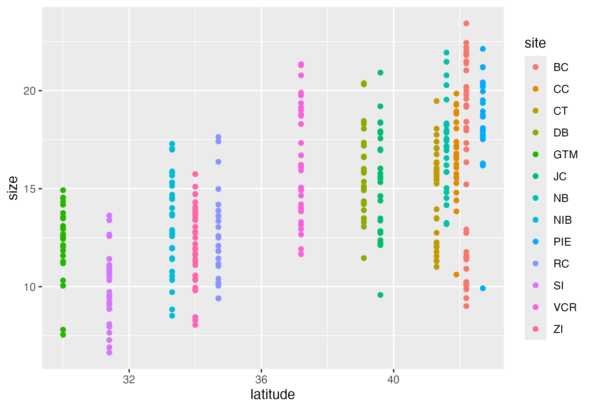

```{r setup, include=FALSE}
knitr::opts_chunk$set(echo = FALSE, warning=FALSE, message=FALSE)
```

```{r loadlib, message=FALSE}
library(tidyverse)
library(lterdatasampler)
library(grateful)
library(ggplot2)
```

# Introduction

This is my manuscript. I am writing text in **Markdown format.

Markdown makes formatting easy:
- *Italics* with '*...*'
- **Bold** with '**...**'
- Lists with '-' or '1.'

Add a figure: .

# Methods
Here is an in-text citation [@horstLterdatasamplerEducationalDataset2023]

## Field sites


## Data analysis
```{r}
View(pie_crab)

getwd()

a <- ggplot(data=pie_crab) +geom_point(aes(x=latitude,y=size,color=site))

ggsave("./ms_figures/Du_FiddlerCrabProject_Figure-1_V1.png", a)
```


# Results
```{r}


```

# Discussion

# References